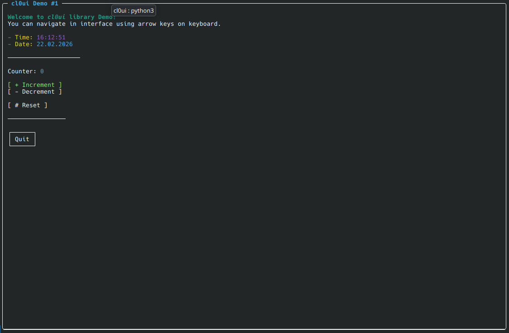

# cl0ui

A lightweight immediate-mode TUI (terminal UI) library for Python built on top of `curses`. No external dependencies.

## Concepts

`cl0ui` uses an **immediate-mode** pattern: `frame()` is called on every render tick. Widgets declared inside it are drawn top-to-bottom in order. Interactive widgets (`button`, `option`) return `True` on the tick when the user activates them.

Navigation is keyboard-only: `↑` / `↓` to move focus, `Enter` or `Space` to activate.

## Docs

- [Widgets](doc/widgets.md)
- [Stylesheets](doc/stylesheets.md)
- [Markup](doc/markup.md)
- [App style](doc/app_style.md)
